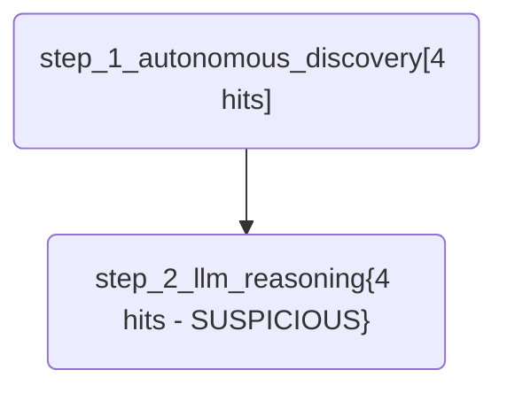

# ApexHunter Report: Agentic Discovery Hunt
**Author:** Lead Hunter
**Hypothesis:** A malicious actor has established persistence via a scheduled task or an unusual process start, and we want to find any evidence of this.
**Severity:** medium

## MITRE ATT&CK Mapping
```json
{
  "name": "Agentic Discovery Hunt",
  "versions": {
    "layer": "4.4",
    "navigator": "4.4",
    "platform": "2.0"
  },
  "techniques": []
}
```

## Execution Flow (Mermaid)


## Detailed Results
### Step: step_1_autonomous_discovery - Autonomously discover suspicious activity in the forensic logs
- **Hits Count:** 4

### Step: step_2_llm_reasoning - Review and reason about the agentic hits
- **Hits Count:** 4
- **LLM Reasoning:** The provided data indicates queries on system tables that relate to process scheduling, execution requests, process creation dates, and scheduled tasks. While it's possible for legitimate software to access these tables, the specific focus on 'cputime', 'start_time', 'CreationDate', and 'nextrunetime' could suggest an attempt to gather information about ongoing processes or scheduled activities, which is often a sign of persistent behavior. However, without additional context such as anomalous patterns in process execution, unusual network traffic, or known malicious indicators (hashes, IP addresses, etc.), it's difficult to definitively classify this as malicious persistence. Therefore, this could be a potential false positive.
- **Suspicious:** True
- **Confidence:** 60%
- **Summary:** The autonomous discovery shows potential signs of persistence by querying system tables related to process scheduling and execution. However, without additional context, it's a potential false positive.
