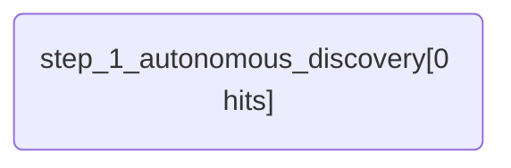

# ApexHunter Report: Agentic Discovery Hunt
**Author:** Lead Hunter
**Hypothesis:** A malicious actor has established persistence via a scheduled task or an unusual process start, and we want to find any evidence of this.
**Severity:** medium

## MITRE ATT&CK Mapping
```json
{
  "name": "Agentic Discovery Hunt",
  "versions": {
    "layer": "4.4",
    "navigator": "4.4",
    "platform": "2.0"
  },
  "techniques": []
}
```

## Execution Flow (Mermaid)


## Detailed Results
### Step: step_1_autonomous_discovery - Autonomously discover suspicious activity in the forensic logs
- **Hits Count:** 0
