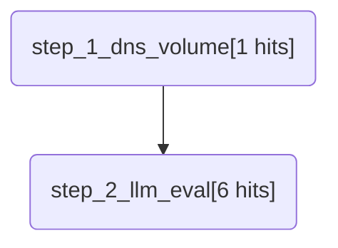

# ApexHunter Report: Ransomware C2 Beacon Hunt
**Author:** SOC Team
**Hypothesis:** Malware infected hosts will exhibit repetitive, high-entropy DNS queries or HTTP requests to unseen domains.
**Severity:** high

## MITRE ATT&CK Mapping
```json
{
  "name": "Ransomware C2 Beacon Hunt",
  "versions": {
    "layer": "4.4",
    "navigator": "4.4",
    "platform": "2.0"
  },
  "techniques": [
    {
      "techniqueID": "T1071.001",
      "color": "#ff6666",
      "comment": "Detected via ApexHunter"
    },
    {
      "techniqueID": "T1568.002",
      "color": "#ff6666",
      "comment": "Detected via ApexHunter"
    }
  ]
}
```

## Execution Flow (Mermaid)


## Detailed Results
### Step: step_1_dns_volume - Identify internal hosts making an unusually high volume of DNS queries to distinct domains
- **Hits Count:** 1

### Step: step_2_llm_eval - Evaluate high-volume DNS host {{target_host}} for DGA patterns using LLM
- **Hits Count:** 6
- **LLM Reasoning:** N/A
- **Suspicious:** False
- **Confidence:** None%
- **Summary:** Ollama failed: model 'llama3' not found (status code: 404)
